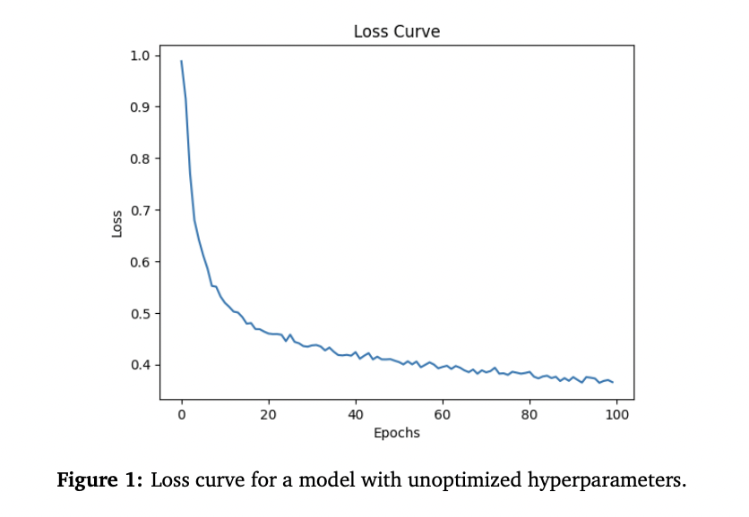
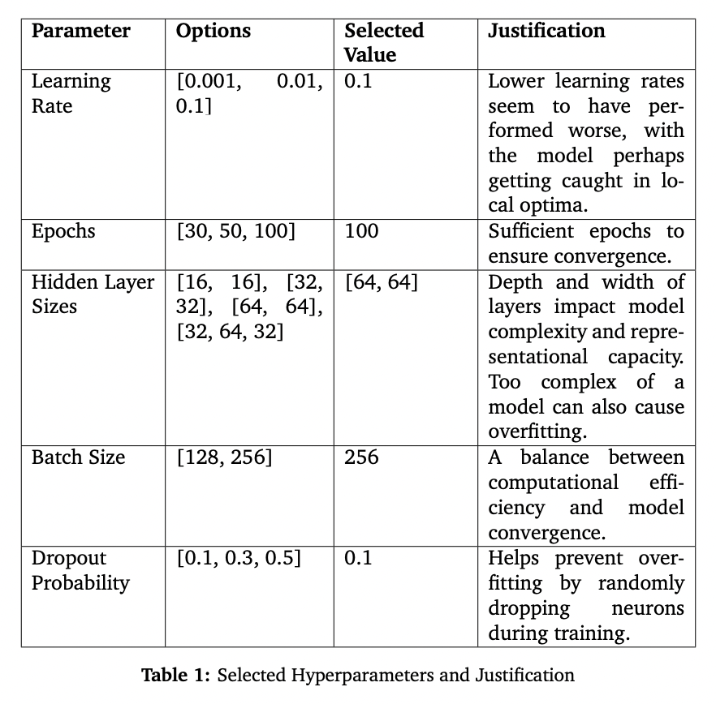
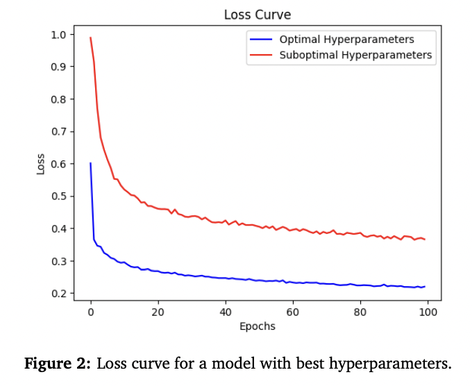

# Neural Network Regression and Classification Models

## Overview

This repository contains implementations of deep neural networks designed for both regression and classification tasks. The models leverage PyTorch's `nn.Module` to dynamically construct neural networks based on specified parameters, making them powerful tools for approximating complex functions. The project focuses on optimising the models through regularisation techniques and an exhaustive hyperparameter search to prevent overfitting and enhance performance.

## Model Architecture

The neural networks are built using PyTorch and are designed to be flexible, allowing for customised input and output sizes, as well as varying numbers and sizes of hidden layers. Key features include:

- **Dynamic Construction**: The models are constructed based on user-specified parameters, allowing for flexibility in architecture.
- **Regularisation**: Dropout layers are used to prevent overfitting by randomly dropping neurons during training.
- **Layer Composition**: Each layer consists of a linear transformation followed by a ReLU activation function and dropout.

## Data Preprocessing

The preprocessing pipeline is designed to handle datasets with both numerical and categorical features:

- **Handling Missing Values**: Missing data is filled with zeros to ensure no gaps during training.
- **Categorical Encoding**: Categorical features are one-hot encoded using `LabelBinarizer`.
- **Normalisation**: Numerical features are normalised using `StandardScaler` to have a mean of zero and a standard deviation of one.

## Training and Fitting

The training process involves:

- **Batch Processing**: Data is processed in batches using `TensorDataset` and `DataLoader`.
- **Optimisation**: The models are trained using stochastic gradient descent (SGD) with Mean Squared Error (MSE) for regression and cross-entropy for classification as the loss functions.
- **Early Stopping**: Training is halted if the loss does not improve, preventing overfitting and saving computational resources.

## Evaluation

The models' performance is evaluated using:

- **Prediction**: The `predict` function processes input data and returns predictions, which are then denormalised for interpretation.
- **Scoring**: The `score` function calculates the Root Mean Square Error (RMSE) for regression and accuracy for classification to assess prediction accuracy.

## Hyperparameter Optimisation

A grid search was conducted over key hyperparameters, including learning rate, number of epochs, hidden layer sizes, batch size, and dropout probability. The optimised models achieved significantly lower loss, indicating improved performance.

## Usage

To train and evaluate the models, follow the instructions in the `scripts` directory. Ensure all dependencies are installed as listed in `requirements.txt`.

### Running the Code

- **NN Library**: The code can be run from the terminal. In the `example_main()`, a simple MLP is defined with selected architecture values. The dataset is loaded, shuffled, and split, followed by data preprocessing, model training, and evaluation on test data.
- **NN Classifier**: The default Regressor with optimal parameters is called. The model design can be edited by changing aspects such as layer sizes and learning rate. It is recommended to create a dictionary of elements to change and pass them into the regressor using `Regressor(X, **hyperparameters)` to avoid errors.

## License

This project is licensed under the MIT License. See the `LICENSE` file for details.
